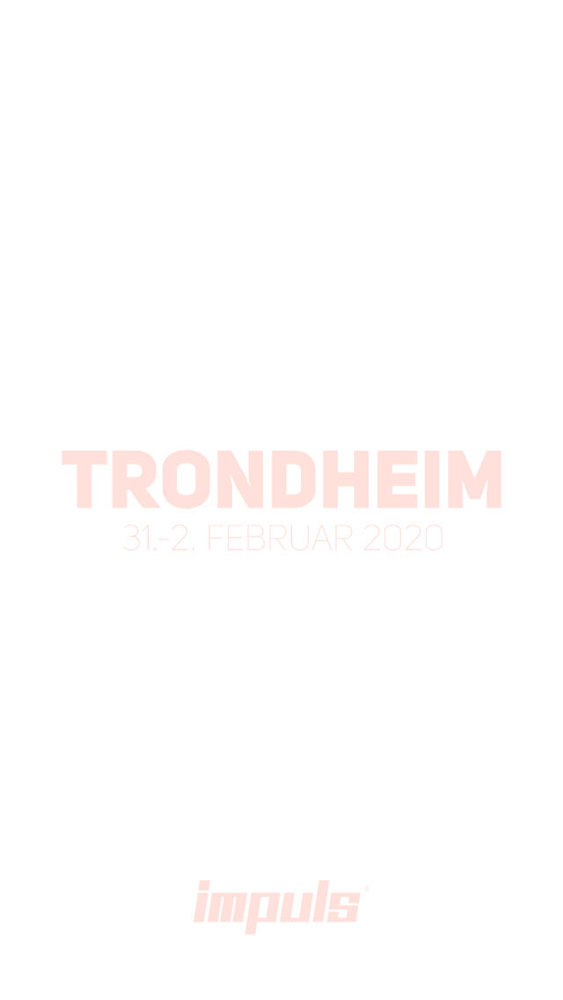

<div align="center">

[](https://koka.no)

### Made by [KoKa](https://koka.no)

</div>

# Impuls-App-Flutter

Open-Source Festival-app written in Flutter for iOS & Android (and possibly web).

[](https://codemagic.io/apps/5e2d8c6fb9213d0d957e20f8/5e2d8c6fb9213d0d957e20f7/latest_build)

- [Impuls-App-Flutter](#impuls-app-flutter)
  - [Get in touch](#get-in-touch)
  - [Report issues / feature requests](#report-issues--feature-requests)
  - [ZenHub](#zenhub)
  - [Dependencies](#dependencies)
    - [Flutter](#flutter)
  - [Getting started with developing](#getting-started-with-developing)
  - [Updating icon](#updating-icon)
  - [Updating splash screen](#updating-splash-screen)
  - [Folder structure](#folder-structure)
  - [Lib-folder](#lib-folder)
    - [Main.dart](#maindart)
    - [Models](#models)
    - [Pages](#pages)
      - [Navigate to SomePage](#navigate-to-somepage)
    - [Providers](#providers)
    - [Requests](#requests)
    - [Views](#views)
    - [Widgets](#widgets)

## Get in touch

[](https://discord.gg/b74XKSw)

We don't bite... And we would love to have you onboard! 😁

If you want to join us in creating awesome stuff, connect with us on Discord.
You are also welcome to just hang around. 😉

## Report issues / feature requests


## ZenHub

<https://app.zenhub.com/workspaces/impuls-5e1f68bc7fc3f65df8ab07e6>

## Dependencies

### Flutter

Flutter is the glue that make creating a universal app (iOS + Android) possible.
[Check it out](https://flutter.dev/) , it's pretty awesome.

## Getting started with developing

```bash
git clone git@github.com:kodekameratene/impuls-app-flutter.git
cd impuls-app-flutter
flutter pub get
flutter run
```

## Updating icon


Replace the `icon.png` located `assets/images/icon.png` & run the following command.

```bash
flutter pub run flutter_launcher_icons:main
```

## Updating splash screen



Replace the `splash.png` located `assets/images/splash.png` & run the following command.

```bash
flutter pub run flutter_native_splash:create
```

Try to keep the dimensions the same, so that it will show on all device-resolutions. The current one uses an iPhone SE as a baseline.

Make sure to upload the image with an alpha and change the background color in `pubspec.yaml`.

```yum
flutter_native_splash:
  image: assets/images/splash.png
  color: "#021f2d" <- Change this to your favorite background color
```

## Folder structure

Here is the folder structure of our Flutter app.
Flutter has generated an Android and iOS folder. If you open it you will see that they are normal ios & android projects.

But since we use Flutter, we mostly care about the `lib`-folder.

```tree
.
├── android
│   ├── app
│   └── gradle
├── assets
│   └── images
├── build
│   ├── flutter_assets
│   └── ios
├── ios
│   ├── Flutter
│   ├── Runner
│   ├── Runner.xcodeproj
│   └── Runner.xcworkspace
├── lib
│   ├── models
│   ├── pages
│   ├── providers
│   ├── requests
│   ├── views
│   └── widgets
├── resources
├── test
└── web
```

## Lib-folder

Let's take a closer look at the `lib`-folder.

```tree
lib
├── main.dart
├── models
├── pages
├── providers
├── requests
├── views
└── widgets
```

### Main.dart

Right inside the `lib`-folder you find the main.dart. This is where the whole app gets setup and started.

You can se that we are wiring up our Providers at the root build-method of our app. This makes it easy for our widgets to share some state.
Take a look at this video by Paul Halliday for an introduction to providers.

<https://www.youtube.com/watch?v=8II1VPb-neQ>

He is here also talking about bloc, but I don't think he actually is using the bloc-pattern... Anyways. It's a great video that made Providers easy for me to understand.

### Models

A model is a class that represents the data we want to show in the app.
It helps us in making sure that we use our data in a way that makes sense.
> That was a bit abstract... Talk to Henry if you have any questions. Or update this readme with a better explanation. Thank you.

```tree
models
├── Arrangement.dart
├── Event.dart
├── InfoPost.dart
└── NewsPost.dart
```

> Tip: Use the amazing [JSON to Dart](https://javiercbk.github.io/json_to_dart/)-converter  by [Javier Lecuona](https://github.com/javiercbk) to generate dart classes from your JSON.

### Pages

This is where we put whole "fully-scaffolded" pages.

```tree
pages
├── DetailPage.dart
├── EventDetailPage.dart
├── InfoDetailPage.dart
├── NewsDetailPage.dart
├── TabPage.dart
└── counter.dart
```

#### Navigate to SomePage

```dart
FlatButton(
  child: Text("Navigate to SomePage"),
  onPressed: () => Navigator.push(
    context,
    MaterialPageRoute(
      builder: (context) => SomePage(),
    ),
  ),
);
```

> See https://flutter.dev/docs/cookbook/navigation/navigation-basics for a good introduction to navigation.

### Providers

This is the famous provider. Makes it easy to share state up and down the application-tree cross widgets.

```tree
providers
├── AppSettings.dart
├── ArrangementProvider.dart
├── EventProvider.dart
├── EventsProvider.dart
├── InfoProvider.dart
├── NewsProvider.dart
└── counter_bloc.dart
```

> Todo: Write an introduction

### Requests

This is where we add all our api-endpoints.
Currently we only have one api, that we simply call `api.dart`. But in the future, we may have a api `weather.dart`.

```tree
requests
└── api.dart
```

> The api is connected to a provider that takes the data and makes objects with our models, then provides that data to all our other widgets.

### Views

This is where we add our, you guessed it, *Views*.
A View is a combination of multiple *Widgets*.

A View needs to be shown inside a Page since it lacks the scaffolding that is needed for making it a page.

```tree
views
├── CalendarView.dart
├── InfoView.dart
├── IntroView.dart
└── NewsView.
dart
```

### Widgets

Widgets, widgets, widgets.

This is the place to keep all our custom widgets.

```tree
widgets
├── FrostedButton.dart
├── decrement.dart
├── increment.dart
└── toggleTheme.dart
```


## Contribution guide

### Properly naming branches
When creating a new feature or solving an issue.
Create a new branch `f/<featurename>`
We use `f/` for features `bf/` for bugfix etc...
It doesn't matter that much as long as it makes sense.

### PR
Then create a pull request aka. PR here on GitHub and assign me ([sjoenH](https://github.com/SjoenH)) or the `utvikler`-team as a reviewer.
Assigning the `utvikler`-team will do some load-balancing, auto assigning someone in the team.  

Your branch should be merged into the `develop`-branch (not straight into master). We only have production code in master-branch.
We may delete the feature-branch after it has been merged into develop.

### Publishing a new version
Make a PR from `develop` into `master` and tag your code.
For example. 
```bash 
git tag v1.0.0
git push origin v1.0.0
```

Tagging a release should trigger a new build on [Codemagic](https://codemagic.io/app/5e2d8c6fb9213d0d957e20f8).
[](https://codemagic.io/apps/5e2d8c6fb9213d0d957e20f8/5e2d8c6fb9213d0d957e20f7/latest_build)


## Other stuff to remember

### iOS screenshots to add when submitting to App Store 
<https://help.apple.com/app-store-connect/#/devd274dd925>

Devices:
- [x] 6.5 inch (iPhone 11 Pro Max)
- [x] 5.5 inch (iPhone 8 Plus)
- [x] 12.9 inch (3rd generation iPad Pro)
- [x] 12.9 inch (2nd generation iPad Pro)

